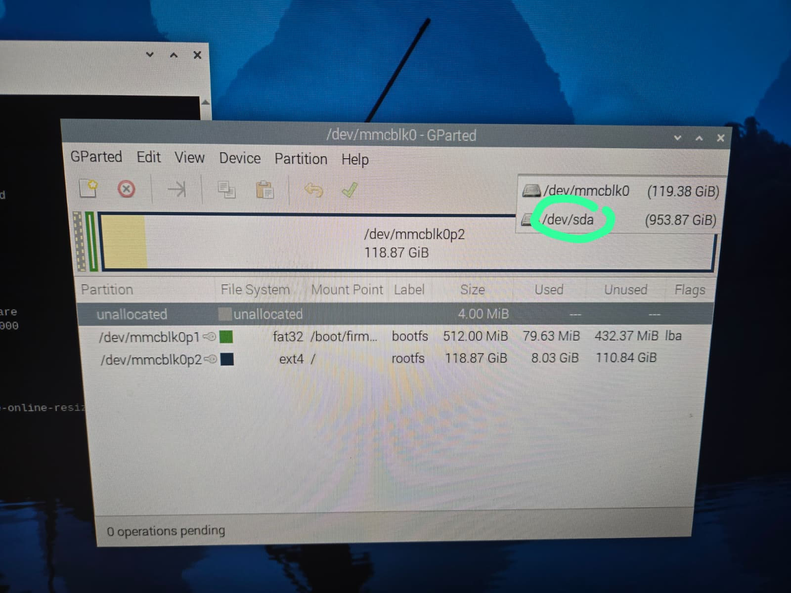

# How to connect SSD


### Check if the Pi sees the SSD
```
lsblk
```
- This shows all drives connected to the pi
- You should see `sda` on there

### Mount the SSD

1. Create a mount point
```
sudo mkdir /mnt/ssd
```
2. Mount the SSD
```
sudo mount /dev/sda1 /mnt/ssd
```

Chances are ^^ that will not work. This is because in your tree you only have `sda` on there you don't have `sda1`

```
sda      931.5G
└─sda1   931.5G
```
`sda` → whole drive (don’t mount this)
`sda1` → first partition (this is what you mount)

your SSD **doesn’t have a partition table yet**. In other words, it’s “raw” and needs to be **formatted and partitioned** before the Pi can use it.

### Install a partitional tool
```
sudo apt update
sudo apt install gparted -y
```
- GParted gives you a **graphical interface** if you’re on the Pi desktop.
- You can also use fdisk in the terminal.

### Create a partition table
**Using GParted (easy, GUI way):**
- Open GParted `(Menu → Accessories → GParted)`
- Select your SSD (`/dev/sda`)
- Go to **Device → Create Partition Table**
- Choose **GPT** (recommended) or **MS-DOS** for compatibility
- Apply



(You can open gparted via the terminal as well)
```
sudo gparted
```

### How to create a partition:
- In GParted, with `/dev/sda` selected, right-click on the unallocated space.
- Choose **New**.
- Set the following:
    - **File system**: `ext4` (for Linux / Nextcloud) or `ntfs` (for Windows compatibility)
    - **Label**: optional, e.g., `SSD`
    - Leave **size** as the default to use the whole drive.
- Click **Add**, then **Apply** (green checkmark).


Now you can mount the partition
```
sudo mount /dev/sda1 /mnt/ssd
```


### Check if it is working
Make sure hte partition is mounted
```
df -h
```
- Look for `/dev/sda1` in the list
- The "Mounted on" column should show `/mnt/ssd` (or wherever you mounted it).