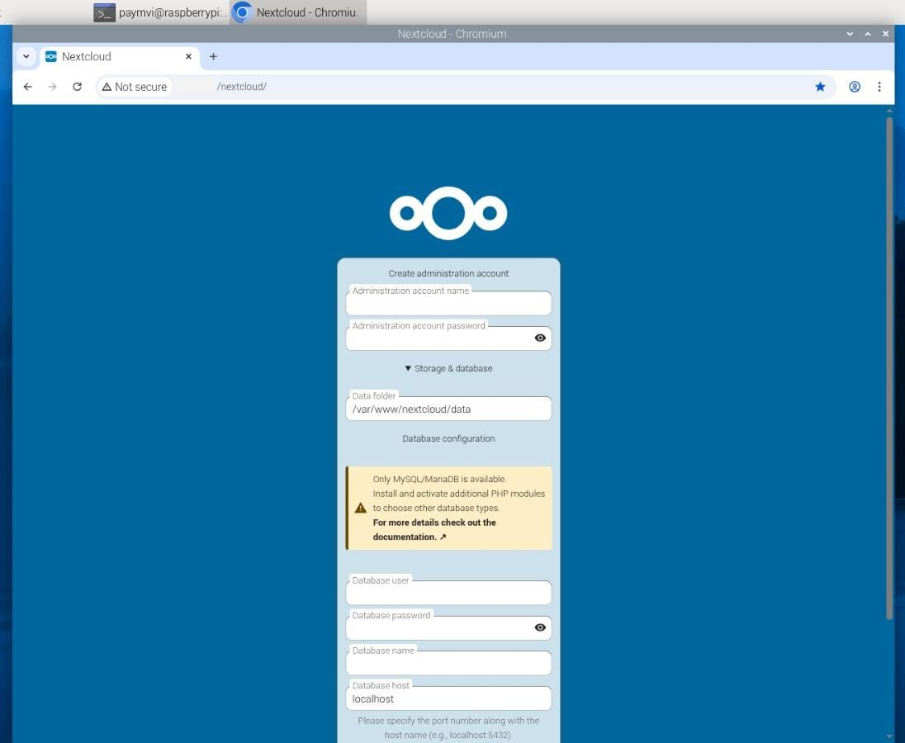

# How to Setup your own Cloud Server

This is how you can make your own google drive! 
- Manual installation style
- Using Nextcloud (yes there is a gui)


**1. Install Apache** or Nginx (web server)
```
sudo apt update
sudo apt install apache2 -y
```

**2. Install PHP** (Nextcloud requires it)
```
sudo apt install php php-cli php-mysql php-gd php-curl php-xml php-mbstring php-zip -y

```

**3. Install MariaDB** (database for Nextcloud)
```
sudo apt install mariadb-server -y
sudo mysql_secure_installation
```
**When prompted:**

- **Enter current password for root:** (Press Enter — it’s empty by default)
- **Switch to unix_socket authentication [Y/n]:** `n`
- **Set a root password:** (choose one)
- **Remove anonymous users:** `Y`
- **Disallow root login remotely:** `Y`
- **Remove test database:** `Y`
- **Reload privilege tables:** `Y`


**4. Download and configure Nextcloud**
```
wget https://download.nextcloud.com/server/releases/latest.zip
sudo unzip latest.zip -d /var/www/
sudo chown -R www-data:www-data /var/www/nextcloud
sudo chmod -R 755 /var/www/nextcloud
```

**5. Enable the Nextcloud site in Apache**
```
sudo nano /etc/apache2/sites-available/nextcloud.conf
```
Then paste this:
```
Alias /nextcloud "/var/www/nextcloud/"

<Directory /var/www/nextcloud/>
  Require all granted
  AllowOverride All
  Options FollowSymLinks MultiViews
</Directory>

<IfModule mod_dav.c>
  Dav off
</IfModule>

```
Save (**Ctrl + O --> Ctrl + x**)

**6. Enable it and restart Apache**
```
sudo a2ensite nextcloud.conf
sudo a2enmod rewrite headers env dir mime
sudo systemctl reload apache2
```
**7. Find your Raspberry Pi's IP address**
```
hostname -I
```
(Look for an address like 192.168.x.x  or  10.0.x.x)

**8. Run**
```
http://<<Your_ip>>/nextcloud
```




**9. Make a database in the terminal.**

Don't be fooled by the GUI. When you do a **manual install zia the web GUI**, the installer does **not create the database itself.**.
- It only **connects to an existing database** and creates the necessary tables inside it.
- That's why you need to create the database first, along with a **database user** and password

(Basically the GUI installer only creates tables inside the database, not the database itself)

**Login into MySQL/MariaDB**
```
sudo sql
```
- This logs you in as the root database user
- You should see a prompt like: MariaDB [(none)]
```
CREATE DATABASE your_database_name;
```
(Use lowercase and don't use spaces or special characters)

Then pick a username and password
```
CREATE DATABASE 'your_username'@'localhost' INDENTIFIED BY 'your_password';
```

Give the user permissions on the database
```
GRANT ALL PRIVILEGES ON your_database_name.* TO 'your_username'@'localhost';
FLUSH PRIVILEGES;
```
- `your_database_name.*` gives permission on all tables in the database
- `FLUSH PRIVILEGES` applies the changes immediately

***Test the connection***
```
EXIT;
```

**10. Input the information into the screen**


... Now it should look like this:


Now just check off how many apps you want to install and now you are all set!!!