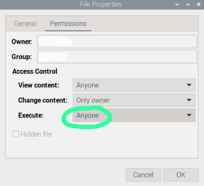

## Install VS Code directly & run
```
sudo apt install code -y
code
```

Note: It will not automatically show in your desktop  
The commands above installs
- the program binary `/usr/bin/code`
- its `.desktop` launcher file (`/usr/share/applicaitons/code.desktop`)

## How to add the VS Code icon to your desktop
**1. Go to the applications Menu**
- Click the Raspberry icon (top-left)
- Scroll to **Programming -> Visual Studio Code**
**2. Right-click -> Add to Desktop**


**3. Make the `code.desktop` file executable**
- Right-click the  `code.desktop` file on the desktop
- Click **Properties -> Permissions**
- Check **"Allow executing file as a program"**
- Close -> Double-click it again

