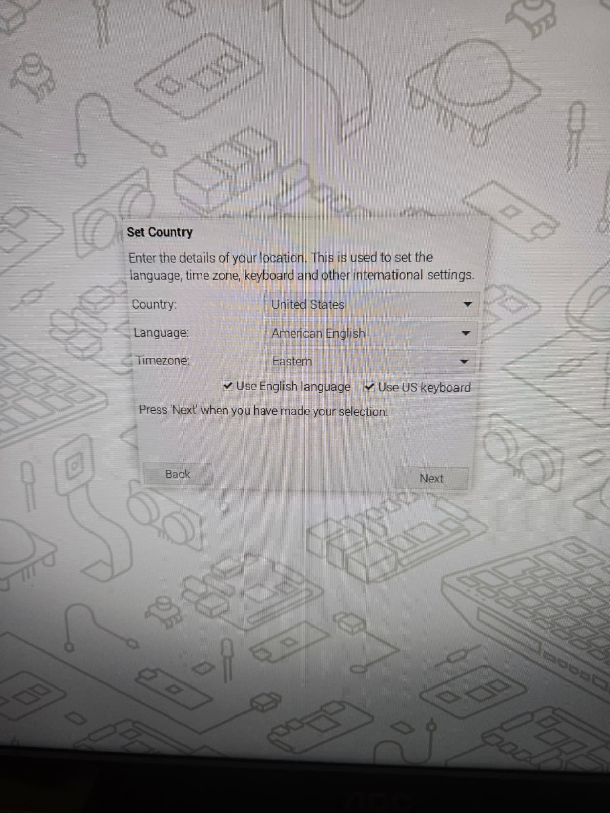

# Initial Setup

### Connect Hardware

To setup the raspberry pi, you need to make sure these are connected:
- The power cable (USB-C)
- The monitor (Mini HDMI)
- The mouse & keyboard (USB)

Personally, bought a mini HDMI male to reg HDMI female cord to connect my reg HDMI monitor to my pi.

I also used a USB hub to connect my old USB plugs to the pi (keyboard and mouse)

### Setup settings

It will ask you to:
- Set country, timezone etc. 
- Then username and password
- Then choose a browser (Chromium or firefox)

After setting those up, it will ask you to choose whether you want to upgrade to Labwc from Wayfire. 
- Labwc is an improved Wayland compositor
- If things go bad, you can switch back to Wayfire using the raspi-config command-line tool

After you choose your settings... you have not finished setting up your raspberry pi!

It now looks like a linux desktop computer.