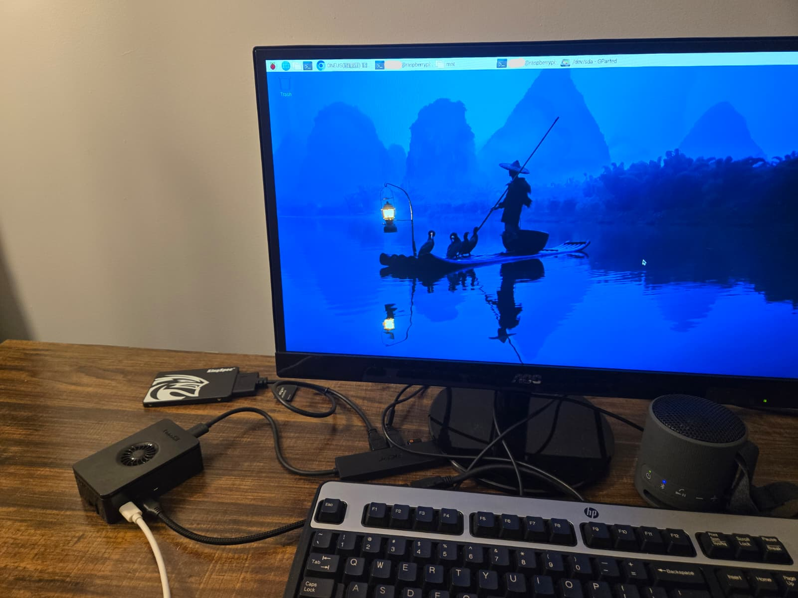

# raspberry-pi

Hello and welcome! 
This is my raspberry pi learning log and here I will log everything I'm learning as I use it!
Credit to Mr Manning for generously giving Ishmael and I these raspberry pis. :)

